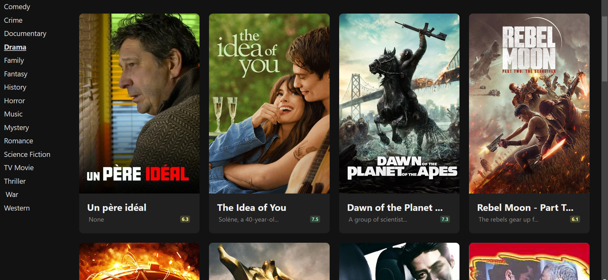

# Movie Discovery Project

This is a simple project which I have used to improve my frontend skills. You can check the site <a href="https://movie-discovery-app-amber.vercel.app/">here</a>. Since I am using <a href="https://developer.themoviedb.org/reference/intro/getting-started">TMDB api</a> you may need to use VPN.
 
The site looks like this:
 
 

 
 

# How to install

Use following instructions: 
1 - clone this project and open the directory 
2 - inside the project directory run below commands 

    npm i
    npm run dev

3 - you can see preview in given link locally
